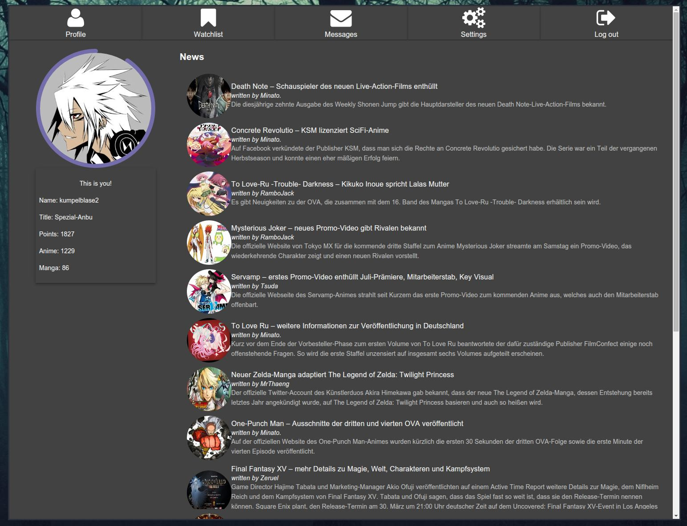

# Proxtop - A proxer.me desktop client


Proxtop is an experimental attempt to create a desktop client for the popular german anime site [proxer.me](https://proxer.me).

This is considered experimental because there's no official API in place so this app parses the site itself to provide the content. Thus, the application might be less responsive as expected or even unusable. Another problem with this route is that UI changes _may_ break this application entirely.

 _(You can find more screenshots in the "screenshots" directory)_

## Goals

These goals are features/use cases that I want this app to provide to the user. All of them should be implemented until I consider this experiment 'done'.

- [x] Use your existing proxer.me account
- [x] View watchlist
- [x] Watch proxer HD streams
- [x] Update watchlist
- [x] Watch streams with favorite video player (prefered: MPV)
- [x] Get notifications on new watchlist releases
- [x] Read & Write messages
- [ ] Have a somewhat nice looking UI

## Optional Goals

Goals that I would like to implement afterwards, if I have interest in continuing. These might never be included.

- Browse animes and search
- Add same functionalities for mangas
- Forum notifications

## Technologies

- Electron
- Angularjs

## What this application is and is not
- It is _not_ a complete frontend/replacement for proxer.me, it is just an alternative frontend for doing the most common tasks on the site, such as watching anime.
- It is so far _not_ officially supported and thus just a community/personal effort.

## How to run

### Running latest stable
You can find the latest stable releases under [Releases](https://github.com/kumpelblase2/proxtop/releases/latest) in the repository. There you can download the right archive for your platform. Extract it and run the `Proxtop` executable inside the directory.

### Running latest/development version
First get all required dependencies (requires NPM and bower to be installed):
```
make
# Or this:
npm install && bower install
```

Run tests via:
```
npm test
```

Run the application via:
```
npm start
```

Or if you want to build the application:
```
make clean
make build
# And if you want to package it:
make package
```

## FAQ

> This seems like a hard and terrible way to do it!

You might say that and you wouldn't be wrong. However, until the API is out, which might take forever, I still want something like this app to exist and that I can use. Even if it will end up in a state where only myself could use it, as long as it is there. Also, I've done some small parts this way in the past and those still work, so I don't really have a problem doing it this way.

> Why do you need an app on desktop if you have the browser?

This is a reasonable question, so let me tell you this:

1. In the browser the page is fixed, meaning the layout, menu and style are not really modifyable by me. If I don't like the style or if I want to make certain workflows faster, how would I do that? I don't want to end up with millions of lines of injected js code to change the site and get totally thrown off once the design changes. I'll probably end up with the same thing here, but in a separate app it's far easier to manage than a hacky script that ends up getting injected.
2. I cannot easily embed the content of the web page into other things, like a video player. There's no nice way for example to open the video in my local media player. Why would I want this? Better video controls, less memory footprint (some of the player are just ... ugh, shitty. Do you remember flash?) and brings more flexibility.
3. I can easily add new functionality without, again, fiddling with content scripts or maybe even doing things totally different.

TL;DR: Convenience, because I like to do things differently.

> Doesn't this hurt the page creators?!

Page load: Page load is a concern, as this is a hobby website and thus only limited resources are available. However, this is not really a concern as this app does similar/identical requests to the page as if a user would do the same steps. However, with convenience features like watchlist notification, this might be less true, as it has to check in the background if new ones are available which would cause more page loads to happen. I do believe however this is no big concern as by default these requests do not happen often.

Advertisments: There are three cases
1. You donate to the creators already, which results in no ads on the site, thus no difference.
2. You have an adblocker installed so you there's no difference either.
3. You have no adblocker installed and would normally see ads. This is the only case ad revenue would be missed.

I hate ads myself, so I don't see this app getting ads to increase revenue for the creators being a thing. Just donate; makes everyone happier.

## License
This application is licensed under the MIT license. See the `LICENSE` file in this repository for more information.

The Proxtop Logo is licensed under the Creative Commons BY-NC-SA 4.0. You can find more details and the full license text at http://creativecommons.org/licenses/by-nc-sa/4.0/ .
